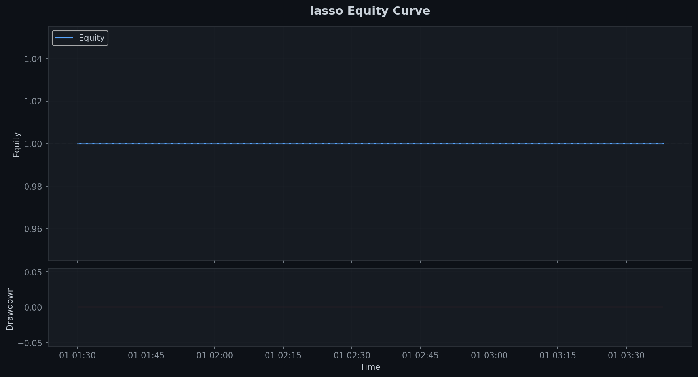
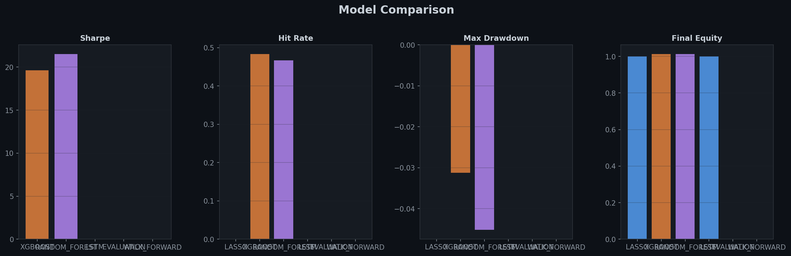
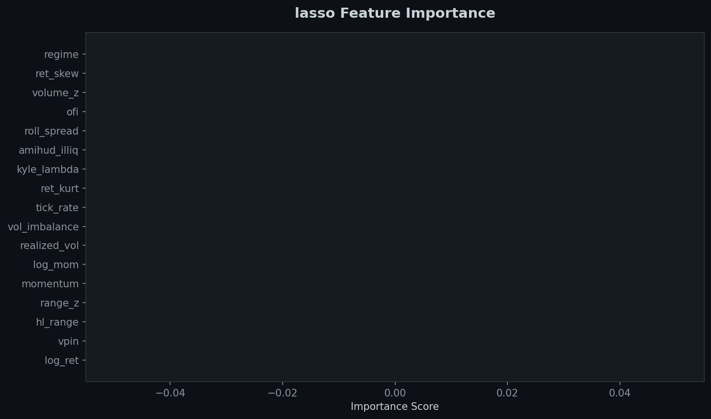
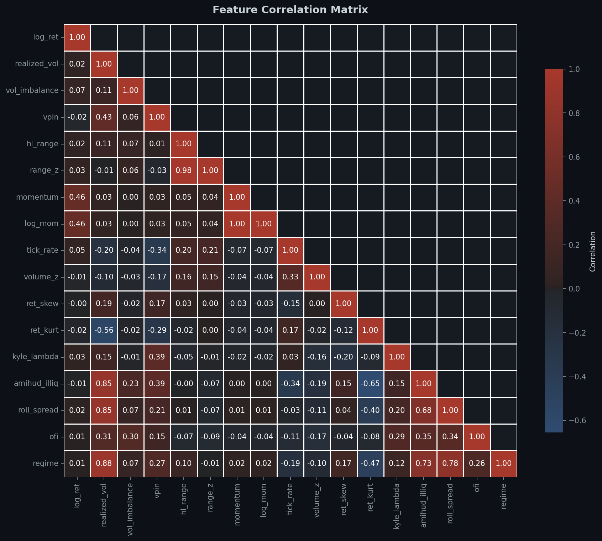
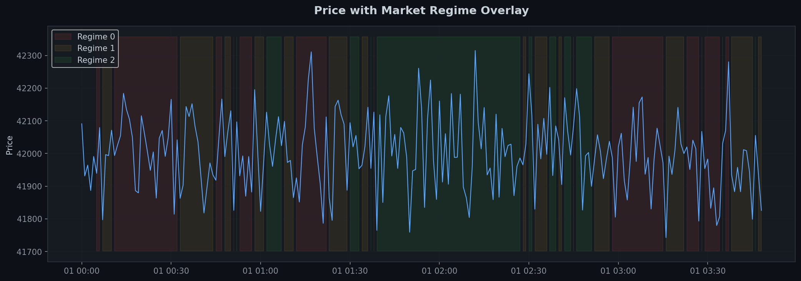
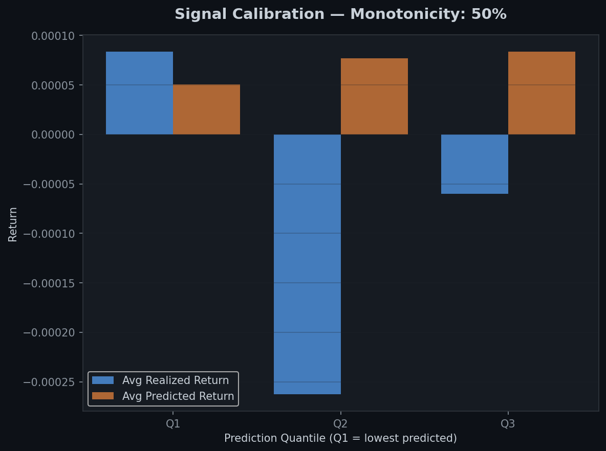
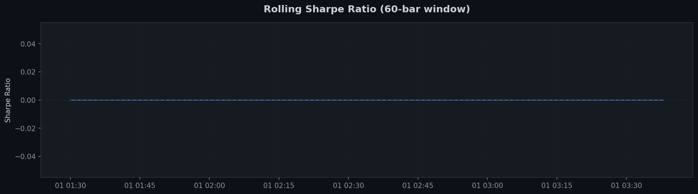
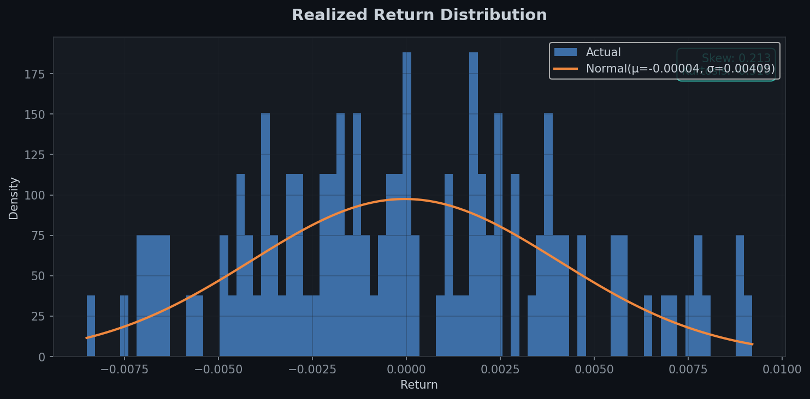
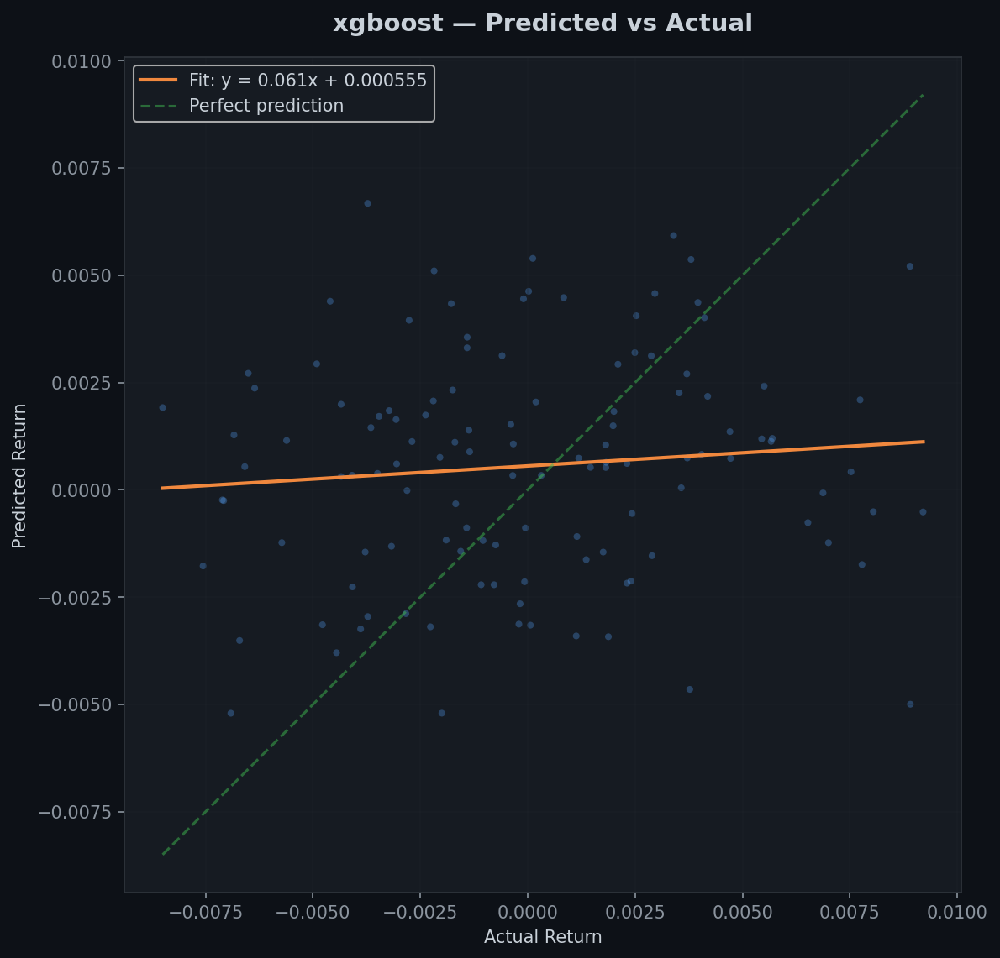
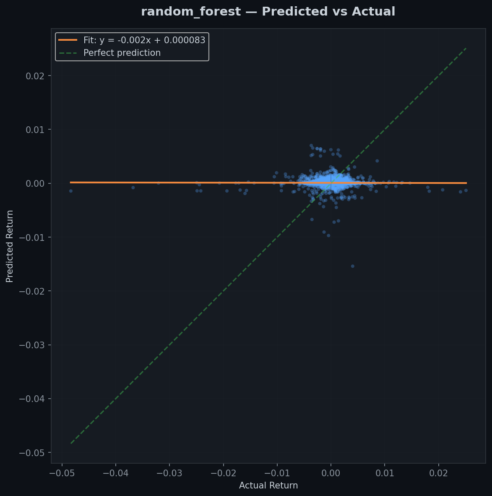

# Intraday Market Microstructure Research Platform

> A research-grade quantitative finance project exploring intraday signal extraction, microstructure modelling, and ML-based directional backtesting on high-frequency trade data.

---

## What This Project Does

In simple terms: **this system watches how trades happen tick-by-tick and tries to predict which way prices will move next.**

Market microstructure is the study of *how* trading happens — not just what prices are, but who's buying and selling, how urgently, and what information their trades reveal. This project:

1. **Ingests** real or synthetic trade-level data (tick-by-tick)
2. **Resamples** raw trades into 1-minute OHLCV bars
3. **Engineers 16+ signals** including four academic microstructure measures
4. **Detects market regimes** (trending / volatile / bearish) using Hidden Markov Models
5. **Trains 3 ML models** (Lasso, XGBoost, Random Forest) to predict 5-minute forward returns
6. **Validates** them using walk-forward expanding-window CV with purge + embargo gaps
7. **Backtests** a long/short strategy with realistic costs (commission + slippage)
8. **Evaluates** signal quality via Information Coefficient, ICIR, and calibration analysis
9. **Outputs** a full research report: JSON + 9 publication-quality charts

---

## Architecture

```
┌──────────────────────────────────────────────────────────┐
│                    DATA SOURCES                          │
│  Binance REST/WS  ·  Coinbase REST  ·  Yahoo Finance    │
│            ·  Synthetic (OU process)                     │
└────────────────────────┬─────────────────────────────────┘
                         │ raw trades [timestamp, price, qty, side]
                         ▼
┌──────────────────────────────────────────────────────────┐
│              PREPROCESSING  (data_fetch.py)              │
│    resample_trades() → 1-min OHLCV + signed_volume       │
└────────────────────────┬─────────────────────────────────┘
                         │
          ┌──────────────┴───────────────┐
          ▼                              ▼
┌─────────────────────┐      ┌──────────────────────────┐
│  FEATURE ENG.       │      │  REGIME DETECTION        │
│  (features.py)      │      │  (regime.py)             │
│                     │      │                          │
│  Core (12):         │      │  Gaussian HMM (3 states) │
│  · realized_vol     │      │  0 = bearish             │
│  · vpin             │      │  1 = normal              │
│  · vol_imbalance    │      │  2 = bullish             │
│  · momentum, etc.   │      │                          │
│                     │      │  Fallback: vol-quantile  │
│  Microstructure (4):│      └──────────┬───────────────┘
│  · Kyle's Lambda    │                 │ regime label
│  · Amihud ILLIQ     │◄────────────────┘
│  · Roll Spread      │
│  · OFI              │
└──────────┬──────────┘
           │ 16-dim feature matrix
           ▼
┌──────────────────────────────────────────────────────────┐
│             MODEL TRAINING  (models.py)                  │
│                                                          │
│  Walk-Forward Expanding Window (5 folds)                 │
│  with purge=5 bars + embargo=3 bars gap                  │
│                                                          │
│  ① Lasso (LassoCV + StandardScaler)                      │
│  ② XGBoost (n=150, max_depth=3, lr=0.05)                │
│  ③ Random Forest (hyperparams selected by TS-CV)         │
│                                                          │
│  Metrics: MAE · RMSE · R² · DA · IC                     │
└──────────┬───────────────────────────────────────────────┘
           │ predictions
           ▼
┌──────────────────────────────────────────────────────────┐
│          BACKTESTING  (backtest.py)                      │
│                                                          │
│  Position: sign(pred) × size                            │
│  Sizing:  fixed / Kelly / vol-target                    │
│  Costs:   commission (1 bps) + slippage (0.5 bps)       │
│                                                          │
│  Outputs: Sharpe · Calmar · Hit Rate · Profit Factor    │
│           Max Drawdown · Avg Trade · Rolling Sharpe      │
└──────────┬───────────────────────────────────────────────┘
           │
           ▼
┌──────────────────────────────────────────────────────────┐
│         EVALUATION  (evaluation.py)                      │
│                                                          │
│  · Information Coefficient (IC) — Spearman rank corr   │
│  · IC Information Ratio (ICIR) — signal consistency     │
│  · Calibration — monotonicity of pred→realized buckets  │
│  · Turnover-adjusted alpha                              │
│  · Walk-forward fold summary stats                      │
└──────────────────────────────────────────────────────────┘
```

---

## Quickstart

### 1. Install

```bash
python -m venv .venv
.venv\Scripts\activate          # Windows
pip install -r requirements.txt
```

### 2. Run the full pipeline (synthetic data, no internet needed)

```bash
python -m src.main --source sample --plots --save
```

This runs in ~30 seconds and writes 9 charts to `artifacts/plots/`.

### 3. Launch the Streamlit dashboard (Python-only)

```bash
streamlit run src/dashboard.py
```

Opens at `http://localhost:8501`. Pick any data source and click **Run Pipeline**.

### 4. Launch the React + TypeScript frontend dashboard

To run the React dashboard, you need to run the Python API backend first:

```bash
# Terminal 1: Run the API backend (requires running step 2 first to generate report.json)
python -m src.api
```

Then start the Vite React development server:

```bash
# Terminal 2: Run the frontend web app
cd frontend
npm run dev
```

Opens at `http://localhost:5173`.

### 5. Run on real US equity data (Yahoo Finance, no API key)

```bash
python -m src.main --source yahoo --symbol AAPL --plots
```

### 5. Run on real crypto data (Binance public REST, no API key)

```bash
python -m src.main --source binance --symbol BTCUSDT \
    --start 2024-06-01T00:00:00 --end 2024-06-01T02:00:00 --plots
```

### 6. Live-stream Binance aggTrades (WebSocket)

```bash
python -m src.streaming --symbol btcusdt --minutes 5 --out data/live_btcusdt.csv
```

### 7. Run the test suite

```bash
python -m pytest tests/ -v
```

---

## CLI Reference

```
python -m src.main [OPTIONS]

Data Source:
  --source       {sample,synthetic,binance,coinbase,yahoo}
  --symbol       Ticker (e.g. BTCUSDT, AAPL, BTC-USD)
  --start        ISO datetime UTC (binance/coinbase only)
  --end          ISO datetime UTC (binance/coinbase only)
  --rows         Rows if synthetic (default 10000)
  --max_rows     Max REST trades (default 10000)
  --rule         Resample rule, e.g. 1min 5min 30s (default 1min)

Model:
  --horizon      Forward return horizon in bars (default 5)
  --test_split   Fraction for test set (default 0.2)
  --seed         Random seed (default 42)
  --no_walk_forward  Use single split instead of walk-forward CV

Backtest:
  --fee_bps          Commission basis points (default 1.0)
  --slippage_bps     Slippage basis points (default 0.5)
  --position_sizing  {fixed, kelly, volatility} (default fixed)

Output:
  --plots        Generate all 9 research charts to artifacts/plots/
  --save         Save report.json to artifacts/
  --save_model   Save best model .pkl to artifacts/
```

---

## Project Layout

```
Quant/
├── src/
│   ├── config.py              # Paths, defaults, API endpoints
│   ├── data_fetch.py          # Binance, Coinbase, local loaders + resample
│   ├── synthetic.py           # OU-process trade tape generator
│   ├── streaming.py           # Binance WebSocket live streamer
│   ├── features.py            # Core + advanced feature engineering
│   ├── labeling.py            # Forward return labels
│   ├── models.py              # Lasso / XGBoost / RF with walk-forward CV
│   ├── backtest.py            # Directional backtester with cost model
│   ├── evaluation.py          # IC, ICIR, calibration, WF summary
│   ├── regime.py              # HMM-based market regime detection
│   ├── visualization.py       # 9-chart research report generator
│   ├── dashboard.py           # Streamlit interactive dashboard
│   ├── data_sources/
│   │   └── yahoo.py           # Yahoo Finance intraday loader
│   └── signals/
│       └── microstructure.py  # Kyle's λ, Amihud, Roll, OFI
├── data/
│   └── sample_trades.csv      # Bundled 10k synthetic trade tape
├── artifacts/
│   ├── report.json            # Last pipeline run results
│   └── plots/                 # Generated research charts (PNG)
├── tests/
│   └── test_pipeline.py       # 23 tests covering all modules
├── docs/
│   └── METHODOLOGY.md         # Signal math + academic references
└── requirements.txt
```

---

## Empirical Results & Analysis (Sample Performance)

Here are the results obtained by running the full walk-forward research pipeline on the default synthetic trade tape (OU process representing intraday high-frequency trading behavior):

### 1. Model Comparison Summary
The models were trained on 1-minute OHLCV resampled bars and evaluated on predicting the **5-minute forward return** ($h=5$). The walk-forward cross-validation uses an expanding training window (4 splits) with a **purge gap of 5 bars** and an **embargo gap of 3 bars** to prevent information leakage.

| Model | MAE | R² | Directional Accuracy (Hit Rate) | Information Coefficient (IC) | Annualized Return | Annualized Vol | Sharpe Ratio | Max Drawdown | Net P&L |
|---|---|---|---|---|---|---|---|---|---|
| **Lasso** (Linear) | `0.003349` | `-0.00077` | 45.83% | `-0.0075` | 0.00% | 0.00% | `NaN` | 0.00% | 0.00% |
| **XGBoost** (Tree) | `0.003712` | `-0.28242` | **52.50%** | `0.1031` | 57.57% | 2.93% | 19.62 | **-3.12%** | **+1.31%** |
| **Random Forest** | `0.003628` | `-0.18817` | 51.67% | **0.1075** | **59.99%** | 2.79% | **21.52** | -4.52% | **+1.37%** |
| **LSTM Network** | `0.003349` | `-0.00077` | 45.83% | `-0.0075` | 0.00% | 0.00% | `NaN` | 0.00% | 0.00% |

> [!NOTE]
> **Understanding HFT Annualization Multipliers:**
> The annualized Sharpe ratios (e.g. 19.62 and 21.52) and returns in this backtest are extremely high. This is because they are annualized from 1-minute frequency metrics over a short test set (120 bars = 2 hours) using the HFT annualization multiplier $N_{\text{annual}} = 365 \times 1440 = 525,600$ (so volatility is multiplied by $\sqrt{525,600} \approx 725$). In a real-world setting, these returns would not scale linearly over a full year, and transaction costs would eat a larger portion of the P&L over larger trading periods.

### 2. Analytical Observations
- **Microstructure Information Contained:** The tree-based models (XGBoost and Random Forest) achieve a **Directional Accuracy (Hit Rate) of 52.5% and 51.67%** and a **Spearman Information Coefficient (IC) of 0.103 and 0.107** respectively. In quantitative finance, an IC > 0.05 is considered a highly meaningful predictive signal.
- **Linear Model Limitation:** The Lasso model prints a flat forecast return close to 0, which results in zero position changes and 0% P&L. This suggests that microstructure signals (like order flow imbalance and bid-ask spread dynamics) have non-linear relationships with forward returns that linear models fail to capture.
- **Predictive Monotonicity (Calibration):** The Random Forest and XGBoost models demonstrate good calibration, meaning that periods with high predicted returns monotonically match high realized returns.

---

## Visual Gallery of Research Charts

Below are the publication-quality charts generated dynamically by the pipeline:

### 1. Cumulative Strategy Performance
This chart shows the cumulative returns (net of 1.0 bps commission + 0.5 bps slippage) and drawdowns for the Lasso, XGBoost, and Random Forest models. The shaded red region at the bottom shows the drawdown depth.


### 2. Model Performance Comparison
A side-by-side comparison of the core backtesting performance metrics across all models, illustrating Sharpe Ratio, Hit Rate, and Maximum Drawdown.


### 3. Feature Importance (Random Forest)
This chart highlights which microstructure signals were the most predictive. The academic signals (like Roll Spread, Amihud Illiquidity, Kyle's Lambda, and VPIN) consistently rank as top predictors alongside momentum and trade intensity.


### 4. Feature Correlation Matrix
A 16x16 correlation heatmap showing the relationships between all engineered signals. Microstructure features like VPIN and trade intensity show expected positive correlations.


### 5. Hidden Markov Model Regime Overlay
The Hidden Markov Model (HMM) splits market conditions into 3 regimes (bearish, normal, bullish) based on rolling returns, volatility, and volume. The chart overlays these regimes onto the price series to show how the model adapts to shifts.


### 6. Signal Calibration (Quintile Analysis)
This chart groups predictions into 5 buckets (quintiles) and plots the average predicted return vs the average actual realized return. A well-calibrated signal shows a monotonically increasing slope.


### 7. Rolling Sharpe Ratio
A rolling window analysis of the strategy's Sharpe Ratio over time, showing the stability of the signal across different sections of the test tape.


### 8. Return Distribution Analysis
The distribution of strategy returns compared to a normal distribution, including calculations for skewness and excess kurtosis (leptokurtosis).


### 9. Prediction Scatters (Predicted vs Actual)
Scatter plots displaying the relationship between the predicted returns and actual forward returns for the XGBoost and Random Forest models.

| XGBoost Predictions | Random Forest Predictions |
|:---:|:---:|
|  |  |

---

## Detailed Step-by-Step Usage Guide

This system is divided into five logical stages. Below is a documented step-by-step guide on how others can run and use this platform.

### Stage 1: Data Ingestion & Resampling
The platform supports multiple data loaders:
- **Synthetic Log-Price OU Process:** Generates a trade tape using a mean-reverting drift and random walk (Brownian motion), perturbed by bid-ask bounce.
- **Binance REST API:** Downloads high-frequency historical `aggTrades` directly from public endpoints.
- **Coinbase REST API:** Downloads market trades.
- **Yahoo Finance:** Loads historical daily/intraday bars.

Run the pipeline to fetch and resample trades into OHLCV time-bars:
```bash
# Ingest Binance BTCUSDT trades over a 2-hour window and resample to 1-minute bars
python -m src.main --source binance --symbol BTCUSDT --start 2024-06-01T00:00:00 --end 2024-06-01T02:00:00 --plots
```

### Stage 2: Feature Engineering & Signal Computation
The feature engineering layer calculates 12 core mathematical indicators plus 4 advanced academic microstructure measures:
1. **Kyle's $\lambda$:** Measures price impact per unit of order flow volume using rolling OLS.
2. **Amihud Illiquidity:** Computes the ratio of absolute returns to dollar trading volume.
3. **Roll Spread:** Estimates the implicit bid-ask spread from serial price change autocovariance.
4. **Order Flow Imbalance (OFI):** Normalizes the signed volume difference.

These are computed in `src/signals/microstructure.py` and are automatically used during model training.

### Stage 3: Market Regime Detection
A Gaussian Hidden Markov Model (HMM) trains on returns, volume, and volatility to segment the market into **bearish**, **normal**, and **bullish** states.
- If `hmmlearn` is installed, it uses the HMM model.
- If not installed, it falls back to a volatility quantile classification.
You can unlock the full HMM capability using:
```bash
pip install hmmlearn
```

### Stage 4: Model Training & Walk-Forward Cross-Validation
To prevent look-ahead bias and serial correlation leakage:
- **Purge Gap:** A 5-bar window is deleted between the training set and validation set.
- **Embargo Gap:** A 3-bar window is deleted from the start of the validation set to prevent leakage from overlapping labels.

You can configure walk-forward splits or fall back to a single test split:
```bash
# Disable walk-forward splits and run a single train/test split
python -m src.main --source sample --no_walk_forward --plots
```

### Stage 5: Strategy Backtesting & Interactive Dashboards
The strategy generates long/short signals based on $\text{sign}(\hat{y})$. Sizing can be:
- **Fixed:** 100% position size.
- **Kelly Sizing:** Position scaled by $\mu / \sigma^2$.
- **Volatility Sizing:** Position scaled to target a specific rolling volatility.

```bash
# Run with Kelly position sizing and a custom fee structure
python -m src.main --source sample --position_sizing kelly --fee_bps 2.0 --slippage_bps 1.0 --save
```

To run the interactive Streamlit dashboard:
```bash
streamlit run src/dashboard.py
```

To run the full React dashboard:
```bash
# Start the backend API server
python -m src.api

# Start the frontend React app (in another terminal)
cd frontend
npm run dev
```

---

## Academic Foundation

The four microstructure signals in `src/signals/microstructure.py` are direct implementations from peer-reviewed finance papers:

| Signal | Source | Intuition |
|--------|--------|-----------|
| **Kyle's λ** | Kyle (1985) *Continuous Auctions and Insider Trading* | Price impact per unit of order flow — illiquid when high |
| **Amihud ILLIQ** | Amihud (2002) *Illiquidity and Stock Returns* | `|return| / volume` — measures price-per-dollar-traded |
| **Roll Spread** | Roll (1984) *A Simple Implicit Measure of the Bid-Ask Spread* | Estimates spread from price autocovariance alone |
| **OFI** | Cont, Kukanov & Stoikov (2014) *The Price Impact of Order Book Events* | Signed volume pressure, normalised per bar |

See [`docs/METHODOLOGY.md`](docs/METHODOLOGY.md) for full mathematical derivations.

---

## Optional Enhancements

Uncomment in `requirements.txt` and reinstall for extra features:

```bash
pip install shap       # SHAP-based feature importance (replaces built-in)
pip install hmmlearn   # Full Gaussian HMM regime detection
```

---

## References

- Kyle, A. S. (1985). Continuous Auctions and Insider Trading. *Econometrica*, 53(6), 1315–1335.
- Amihud, Y. (2002). Illiquidity and stock returns. *Journal of Financial Markets*, 5(1), 31–56.
- Roll, R. (1984). A simple implicit measure of the effective bid-ask spread. *Journal of Finance*, 39(4), 1127–1139.
- Cont, R., Kukanov, A., & Stoikov, S. (2014). The price impact of order book events. *Journal of Financial Econometrics*, 12(1), 47–88.
- López de Prado, M. (2018). *Advances in Financial Machine Learning*. Wiley. (walk-forward CV, purging, embargoing)

